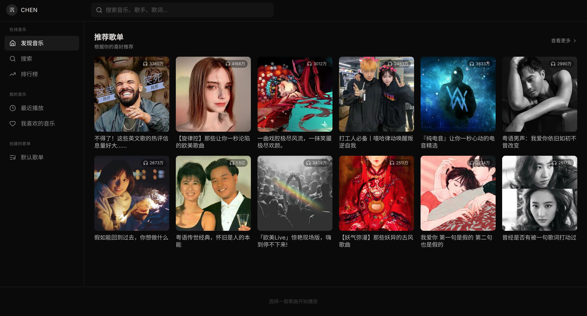
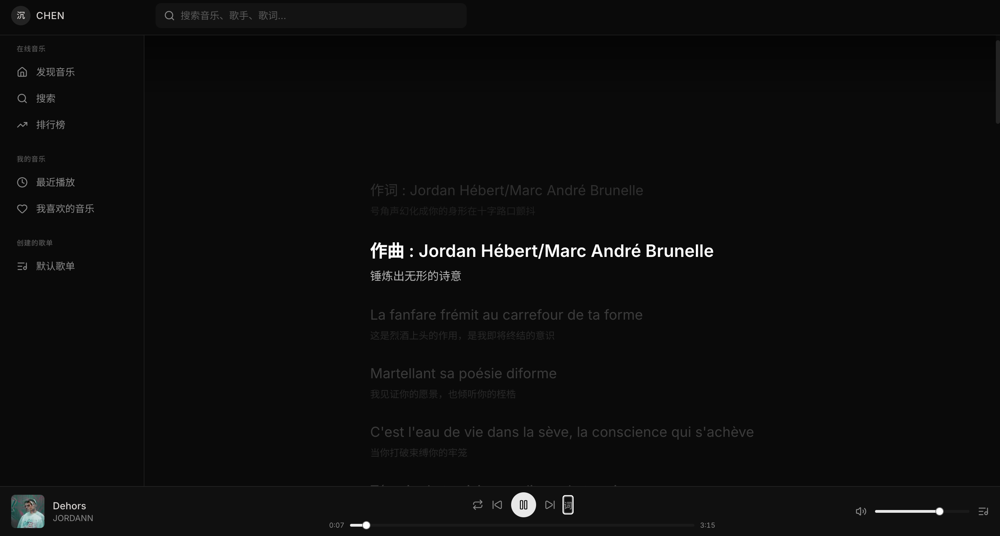
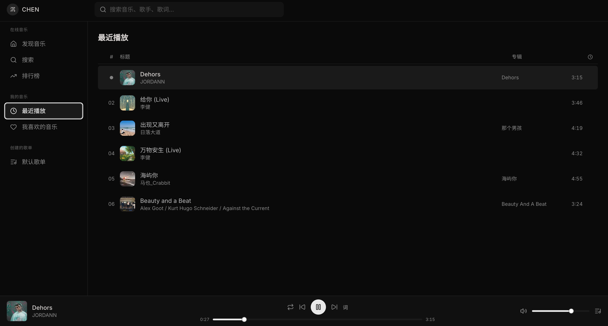
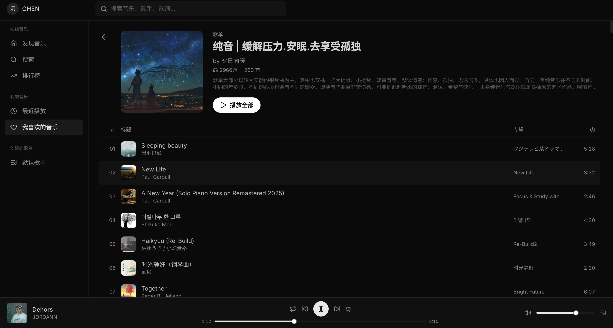

# 沉 - CHEN PLAYER

一个基于网易云音乐 API 的 Web 音乐播放器。

## 截图

### 登录页


### 首页 - 推荐歌单


### 歌单详情


### 歌词面板


## 功能

- 推荐歌单浏览
- 歌曲搜索
- 排行榜（飙升榜、新歌榜、热歌榜、原创榜）
- 歌单详情展示
- 音乐播放控制（播放/暂停、上下曲、进度条、音量）
- 歌词同步显示
- 最近播放记录
- 网易云音乐扫码登录（支持播放 VIP 歌曲）

## 技术栈

- **前端**: React 18 + TypeScript + Vite + Tailwind CSS + shadcn/ui
- **后端**: Express (Node.js) 代理网易云音乐 API
- **图标**: Lucide React

## 快速开始

### 1. 安装依赖

```bash
npm install
```

### 2. 启动后端 API 服务

```bash
npm run server
```

后端运行在 `http://localhost:3001`

### 3. 启动前端开发服务器

```bash
npm run dev
```

前端运行在 `http://localhost:5174`

### 4. 打开浏览器

访问 `http://localhost:5174`，扫码登录或点击"先逛逛"即可使用。

## 项目结构

```
t2/
├── server/
│   └── index.js              # Express 后端 API
├── src/
│   ├── api/
│   │   ├── netease.ts        # API 封装
│   │   └── types.ts          # TypeScript 类型
│   ├── components/
│   │   ├── ui/               # shadcn/ui 组件
│   │   ├── layout/           # 布局组件（TopBar, Sidebar, PlayerBar）
│   │   ├── discover/         # 首页（推荐歌单）
│   │   ├── search/           # 搜索页
│   │   ├── playlist/         # 歌单详情
│   │   ├── ranking/          # 排行榜
│   │   ├── recent/           # 最近播放
│   │   ├── lyrics/           # 歌词面板
│   │   └── Login.tsx         # 登录页
│   ├── player/
│   │   ├── usePlayer.ts      # 播放器状态管理
│   │   └── useAudioViz.ts    # 音频可视化
│   ├── utils/
│   │   ├── format.ts         # 格式化工具
│   │   └── recent.ts         # 最近播放记录
│   ├── App.tsx
│   └── main.tsx
├── images/                   # 截图
├── package.json
└── README.md
```

## API 接口

| 接口 | 方法 | 说明 |
|------|------|------|
| `/api/search` | GET | 搜索歌曲 |
| `/api/song/url` | POST | 获取播放链接 |
| `/api/song/detail` | GET | 获取歌曲详情 |
| `/api/lyric` | GET | 获取歌词 |
| `/api/playlist` | GET | 获取歌单详情 |
| `/api/top/playlist` | GET | 推荐歌单 |
| `/api/toplist` | GET | 排行榜列表 |
| `/api/login/qrcode/key` | POST | 获取登录二维码 |
| `/api/login/status` | GET | 检查登录状态 |
